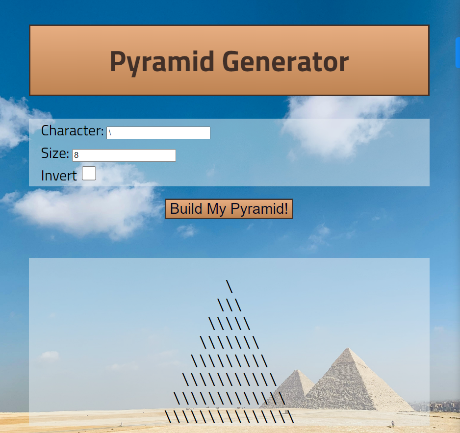

# Pyramid Generator

- [Overview](#overview)
  - [Screenshot](#screenshot)
  - [Links](#links)
- [My process](#my-process)
  - [Built with](#built-with)
  - [What I learned](#what-i-learned)
  - [Continued development](#continued-development)
  - [Useful resources](#useful-resources)
- [Author](#author)
- [Acknowledgments](#acknowledgments)

## Overview
- This is a simple Pyramid Generator that works with arrays, strings, functions, loops, if/else statements, and more. Manipulate the variables to change the pyramid's size and "bricks". You can even use the boolean to invert the pryamid.

### Screenshot

### Links
- Solution URL:
 https://github.com/Dev-Wy/Pyramid/
- Live Site URL:
 https://dev-wy.github.io/Pyramid/

## My Process
### Built with
- HTML
- CSS
- JavaScript

### What I learned
- This project refreshed my JavaScript knowledge and helped me connect how each part works it build on each other as the JS fills out. I like being able to easily adjust the design in JavaScript. I wanted to adapt the original JS to a document with HTML and CSS. I'm learning how to connect the JS to the HTML.

### Continued development
- I enjoyed adding the HTML and CSS. I ended up doing a lot more research than I expected to figureout how to link up my HTML and JS, but I learned so many solid lessons.

### Useful Resources: 
- Freecodingcamp.org

## Author
- Jake Wyant
- Portfolio: https://dev-wy.github.io/Portfolio/
- https://forum.freecodecamp.org/u/dev-wy/summary

## Acknowledgments
- Thanks to FreeCodeCamp.org for JavaScript for this project.
- Special thanks to Skillcrush for giving me the foundation to build on.
